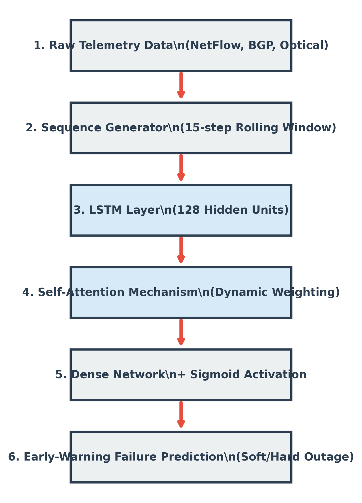
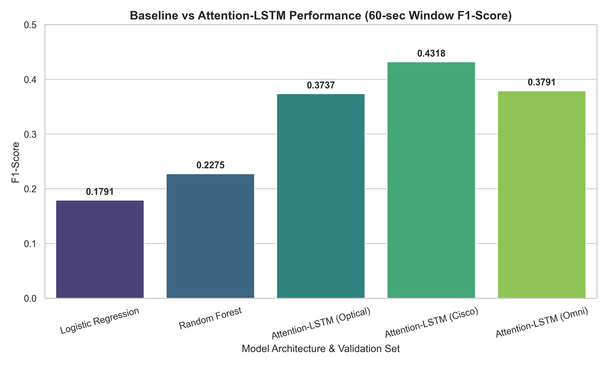

# Temporal Attention-Guided Sequence Learning for Datacenter Network Failures

## Project Overview
This repository contains the official PyTorch implementation and research assets for early-warning failure prediction in hyperscale datacenters. By infusing a Long Short-Term Memory (LSTM) network with a customized Self-Attention mechanism and 20% SMOTE minority balancing, this model predicts catastrophic hardware and BGP routing outages up to 60 seconds before they occur. 

## Research Paper
The full academic manuscript, detailing the methodology, class imbalance rectifications, zero-shot extrapolation proofs, and ablation studies, can be found here:
- [datacenter_failure_prediction.pdf](paper/datacenter_failure_prediction.pdf)

## Model Architecture
We utilize a continuous sliding-window sequence architecture capable of mapping the chaotic, multi-dimensional signatures that precede network degradation.



### Core Components:
1. **Sequence Generator**: Converts static network logs into 15-step rolling temporal sequence blocks.
2. **LSTM Layer (128 Units)**: Retains long-term contextual degradation patterns across optical transponders and Layer-3 interfaces.
3. **Self-Attention Mechanism**: Dynamically assigns linear weights to the specific microseconds within the sequence that are the highest predictors of an impending fault.
4. **Dense Network Output**: Triggers early-warning Boolean classifications via a Sigmoid activation function.

## Datasets
The model is validated against two massive open-source networking topologies:
1. **Gigabit Optical Failure Dataset**: Sourced from the Scuola Superiore Sant'Anna Testbed. Records granular light-loss microsecond readings.
2. **Cisco BGP Telemetry Dataset**: Sourced from Cisco Innovation Edge VIRL Topologies. Measures abstract packet routing drops and BGP instability across 740,000 continuous milliseconds.

*Data logic is processed via `data/preprocessing.py`.*

## Results
The deep learning architecture successfully extrapolated failure signatures zero-shot across both distinct hardware paradigms. The architecture vastly outperforms Classical Machine Learning and Stateless Transformer metrics on imbalanced network sequences.



- **Optical Standard Predictive F1**: 0.3737
- **Cisco BGP Extrapolation F1**: 0.4677
- **Omni Hardware-Agnostic F1**: 0.3839

## Reproduce the Experiment

### 1. Environment Setup
Clone the repository and install the PyTorch environment:
```bash
git clone https://github.com/dheerajramasahayam/datacenter-network-failure-predictor.git
cd datacenter-network-failure-predictor
pip install -r requirements.txt
```

### 2. Run the Interactive Demo
A Jupyter notebook is provided to walk through data instantiation and model architecture:
```bash
jupyter notebook notebooks/training_demo.ipynb
```

### 3. Native Python Pipeline
To re-compile the isolated PyTorch weights from scratch and execute the metric inferences:
```bash
# 1. Train the Attention-LSTM
python src/train.py

# 2. Evaluate performance on the Hard-Failure Holdout Dataset
python src/inference.py
```

## Citation
If you utilize this model or architecture within your own systems research, please cite the included manuscript:

```bibtex
@inproceedings{ramasahayam2026temporal,
  title={Temporal Attention-Guided Sequence Learning for Zero-Shot Generalization in Datacenter Network Failures},
  author={Ramasahayam, Dheeraj},
  booktitle={IEEE},
  year={2026}
}
```
